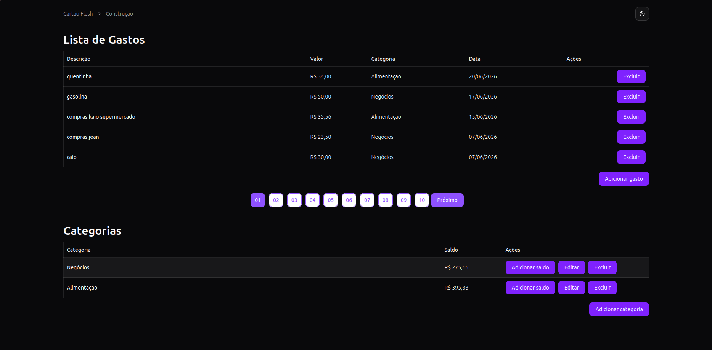
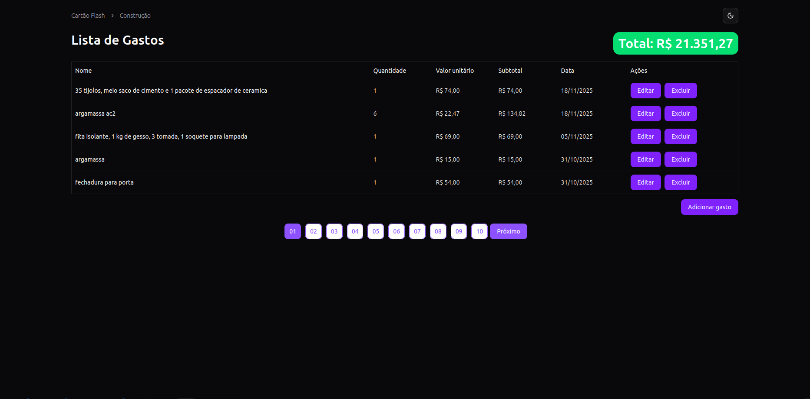
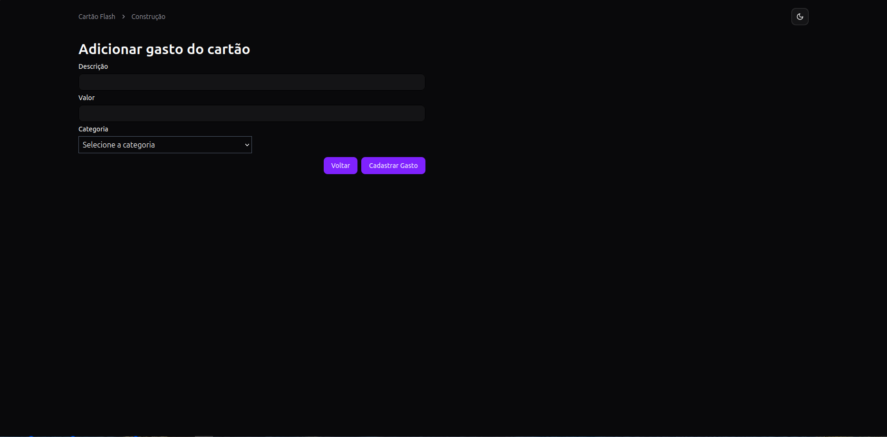
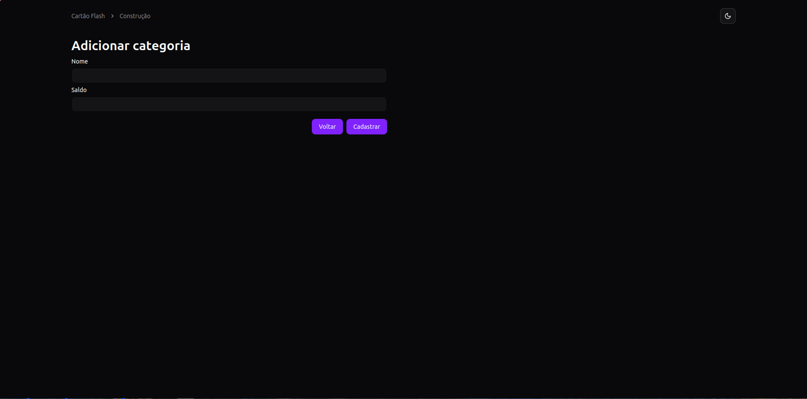
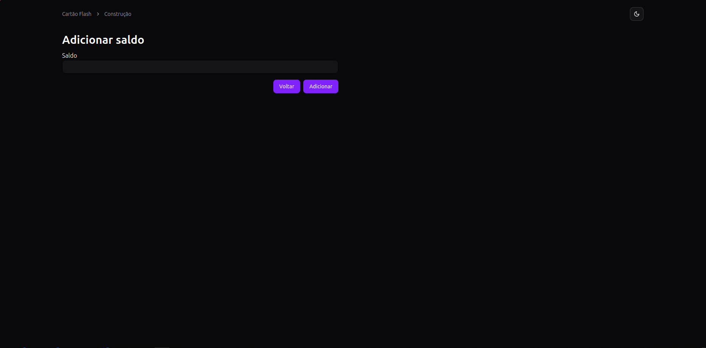
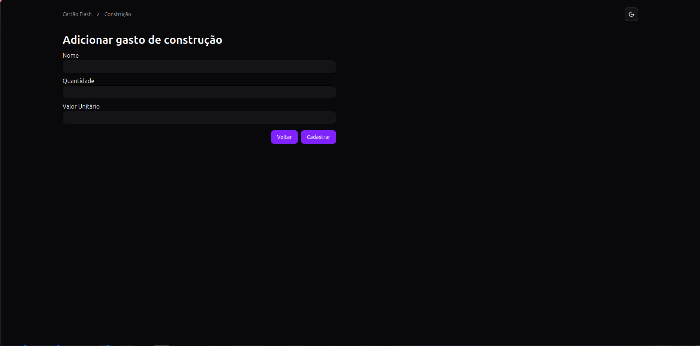

# Finans

**Sistema completo de gerenciamento financeiro pessoal** com controle de gastos, categorias com saldo, e acompanhamento de obras. Arquitetura fullstack conteinerizada com NestJS, React, PostgreSQL e Nginx.

---

## Stack

| Camada | Tecnologia |
|---|---|
| Frontend | React 19, Vite 6, Tailwind CSS 4, Shadcn UI, TanStack Query 5, React Router 7, React Hook Form + Zod |
| Backend | NestJS 11, TypeScript, Prisma 7, PostgreSQL 16, Swagger, Helmet |
| Infraestrutura | Docker, Docker Compose, Nginx, PostgreSQL 16 |

---

## Arquitetura

```
┌──────────────────────────────────────────────────────────┐
│                    Docker Compose                         │
│                                                          │
│  ┌──────────┐    ┌──────────┐    ┌──────────────────┐   │
│  │   db      │    │ backend   │    │   frontend        │   │
│  │ Postgres │◄──►│ NestJS   │◄──►│ Nginx + React     │   │
│  │ :5432    │    │ :3004    │    │ :80               │   │
│  └──────────┘    └──────────┘    └──────────────────┘   │
│       ▲               ▲                   ▲              │
│       │   5433:5432   │   3000:3004       │   8081:80    │
│       └───────────────┴───────────────────┘              │
│                    Host (localhost)                       │
└──────────────────────────────────────────────────────────┘
```

### Fluxo de requisição

```
Browser ──► localhost:8081 ──► Nginx
                                  │
                                  ├── /api/* ──► proxy_pass ──► backend:3004 ──► Prisma ──► db:5432
                                  │
                                  └── /* ──► serve index.html (SPA)
```

---

## Containerização

O projeto utiliza **Docker Compose** para orquestrar 3 serviços que rodam em paralelo em uma rede isolada, garantindo que se comuniquem via DNS interno.

### Serviços

| Serviço | Imagem | Porta (Host:Container) | Depende de |
|---|---|---|---|
| `db` | `postgres:16` | `5433:5432` | — |
| `backend` | build local (`./backend/Dockerfile`) | `3000:3004` | `db` (healthcheck) |
| `frontend` | build local (`./frontend/Dockerfile`) | `8081:80` | `backend` |

### Orchestação e inicialização paralela

O Docker Compose gerencia o ciclo de vida completo dos containers:

1. **Rede compartilhada** — Todos os serviços são criados na mesma rede padrão do Compose, permitindo que se descubram pelo nome do serviço (ex.: `db`, `backend`).

2. **Ordem de inicialização** — Embora o Compose inicie os serviços em paralelo, as dependências garantem a ordem correta:
   - `db` sobe primeiro (sem depências).
   - O Compose aguarda o **healthcheck** do `db` antes de liberar os dependentes:
     ```yaml
     healthcheck:
       test: ["CMD-SHELL", "pg_isready -U postgres"]
       interval: 5s
       timeout: 5s
       retries: 5
     ```
   - `backend` e `frontend` só começam a ser criados após o `db` estar saudável.

3. **Entrypoint do backend** (`entrypoint.sh`) — Script que executa dentro do container:
   ```bash
   # 1. Aguarda o PostgreSQL aceitar conexões
   while ! nc -z db 5432; do sleep 1; done
   # 2. Aplica migrations pendentes
   npx prisma migrate deploy
   # 3. Inicia a aplicação
   node dist/main.js
   ```

4. **Paralelismo real** — Após o `db` estar pronto, `backend` e `frontend` constroem e sobem **simultaneamente**, cada um em seu próprio container.

### Dockerfiles

**Backend** (`backend/Dockerfile`):
- Stage único baseado em `node:22`
- Instala dependências com `npm install`
- Gera Prisma Client, compila TypeScript
- Instala `netcat-openbsd` para o healthcheck do entrypoint
- Expõe porta 3004

**Frontend** (`frontend/Dockerfile`):
- **Multi-stage** para imagem final enxuta:
  - **Stage 1 (builder):** `node:22-alpine` — instala dependências e executa `npm run build` (Vite)
  - **Stage 2 (runtime):** `nginx:alpine` — copia o build para `/usr/share/nginx/html` e aplica configuração personalizada
- Expõe porta 80

### Volumes

```yaml
volumes:
  banco_data:       # Volume nomeado para persistência do PostgreSQL
```

O volume `banco_data` monta em `/var/lib/postgresql/data` dentro do container `db`, garantindo que os dados sobrevivam a `docker compose down`.

### Rede e descoberta de serviços

```yaml
# Backend conecta ao banco via nome do serviço
DATABASE_URL="postgresql://postgres:123@db:5432/finans?schema=public"

# Nginx no frontend faz proxy reverso para o backend
location /api {
    proxy_pass http://backend:3004/api;   # ← DNS interno do Compose
}
```

### Comando para iniciar

```bash
docker compose up -d --build
```

O Compose então:
1. Cria a rede e o volume
2. Faz pull da imagem `postgres:16`
3. Constrói as imagens `backend` e `frontend`
4. Inicia `db`, aguarda healthcheck
5. Inicia `backend` e `frontend` em paralelo
6. Expõe as portas para o host

---

## Banco de Dados

### Schema (Prisma)

```prisma
model Category {
  id        String   @id @default(uuid())
  name      String
  balance   Decimal  @db.Decimal(10, 2)
  spent     Spent[]
  createdAt DateTime @default(now())
}

model Spent {
  id          String   @id @default(uuid())
  value       Decimal  @db.Decimal(10, 2)
  description String
  categoryId  String
  category    Category @relation(fields: [categoryId], references: [id])
  createdAt   DateTime @default(now())
}

model Construction {
  id           String   @id @default(uuid())
  name         String
  quantity     Int
  unitaryValue Decimal  @db.Decimal(10, 2)
  amount       Decimal  @db.Decimal(10, 2)
  createdAt    DateTime @default(now())
}
```

---

## API (Endpoints)

Todos os endpoints são prefixados com `/api` e documentados via Swagger em `http://localhost:3000/api`.

### Category

| Método | Rota | Descrição |
|---|---|---|
| `POST` | `/api/category/create` | Criar categoria (valida nome único) |
| `GET` | `/api/category/all` | Listar todas as categorias |
| `GET` | `/api/category/:id` | Obter categoria por ID |
| `PATCH` | `/api/category/:id` | Atualizar categoria |
| `PUT` | `/api/category/balance/add/:id` | Adicionar saldo à categoria |
| `DELETE` | `/api/category/:id` | Excluir categoria (bloqueia se houver gastos vinculados) |

### Spent

| Método | Rota | Descrição |
|---|---|---|
| `POST` | `/api/spent` | Criar gasto (deduz do saldo da categoria) |
| `GET` | `/api/spent/all` | Listar gastos (paginado) |
| `GET` | `/api/spent/:id` | Obter gasto por ID |
| `PATCH` | `/api/spent/:id` | Atualizar gasto |
| `DELETE` | `/api/spent/:id` | Excluir gasto |

### Construction

| Método | Rota | Descrição |
|---|---|---|
| `POST` | `/api/construction` | Criar item (calcula `amount = quantity × unitaryValue`) |
| `GET` | `/api/construction/all` | Listar itens (paginado) |
| `GET` | `/api/construction/amount` | Obter soma total de todos os itens |
| `GET` | `/api/construction/:id` | Obter item por ID |
| `PATCH` | `/api/construction/:id` | Atualizar item (recalcula `amount`) |
| `DELETE` | `/api/construction/:id` | Excluir item |

---

## Como executar

### Produção (Docker)

```bash
# Clonar o repositório
git clone <repo-url>
cd finans

# Configurar variáveis de ambiente
cp backend/.env.example backend/.env
# Editar backend/.env se necessário

# Iniciar todos os serviços
docker compose up -d --build
```

Acessar:
- **Frontend:** http://localhost:8081
- **API:** http://localhost:3000/api
- **Swagger:** http://localhost:3000/api

### Desenvolvimento (sem Docker)

```bash
# Backend
cd backend
cp .env.example .env
npm install
npx prisma migrate dev
npm run start:dev

# Frontend (outro terminal)
cd frontend
cp .env.example .env
# Editar VITE_API_URL=http://localhost:3004
npm install
npm run dev
```

---

## Telas do Sistema

> *Adicione aqui capturas de tela das principais interfaces do sistema.*

### Dashboard — Gastos e Categorias



Tela inicial com duas tabelas lado a lado: lançamentos de gastos (com paginação) e categorias cadastradas com saldo disponível e ações rápidas.

### Módulo de Construção



Lista de itens de obra com quantidade, valor unitário, subtotal calculado automaticamente e total geral destacado em verde.

### Cadastro de Gastos



Formulário para registrar um novo gasto com descrição, valor (formatação monetária BRL) e seleção de categoria.

### Cadastro de Categorias



Formulário para criar categoria com nome e saldo inicial.

### Adicionar Saldo



Formulário para incrementar o saldo de uma categoria existente.

### Cadastro de Itens de Construção



Formulário para adicionar item de construção com nome, quantidade e valor unitário — o subtotal é calculado automaticamente.

---

## Variáveis de Ambiente

### Backend (`backend/.env`)

| Variável | Descrição | Exemplo |
|---|---|---|
| `DATABASE_URL` | String de conexão com PostgreSQL | `postgresql://postgres:123@db:5432/finans` |
| `POSTGRES_USER` | Usuário do banco | `postgres` |
| `POSTGRES_PASSWORD` | Senha do banco | `123` |
| `POSTGRES_DB` | Nome do banco | `finans` |
| `PORT` | Porta do servidor NestJS | `3004` |
| `NODE_ENV` | Ambiente de execução | `development` |

### Frontend (`frontend/.env`)

| Variável | Descrição | Exemplo |
|---|---|---|
| `VITE_API_URL` | URL base da API (vazio = proxy Nginx) | `/api` |
